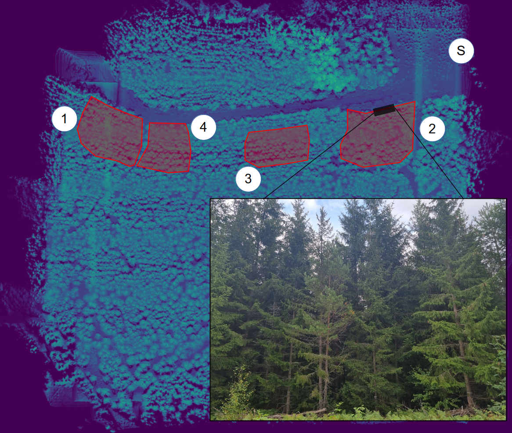
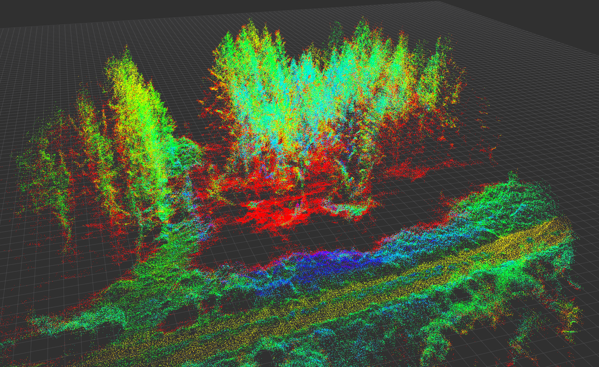
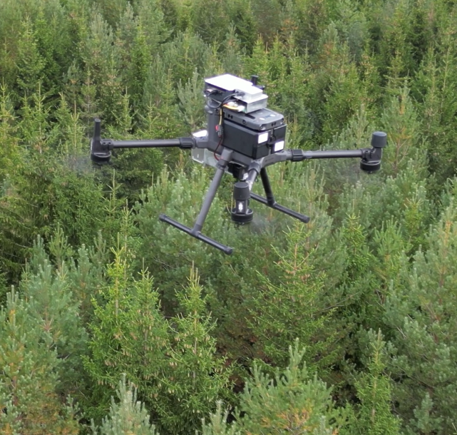

# dense-forest-dataset
This repository contains a dataset collected by UAV over dense boreal forest.

## Dataset description

## Sensor description
The drone used is the Matrice 300. Ranged sensor modalities include LiDAR (Livox Avia), and RGB camera (Basler dart 1600-60uc).

## Example output

### RVIZ point cloud visualization

### Top down point cloud visualization

