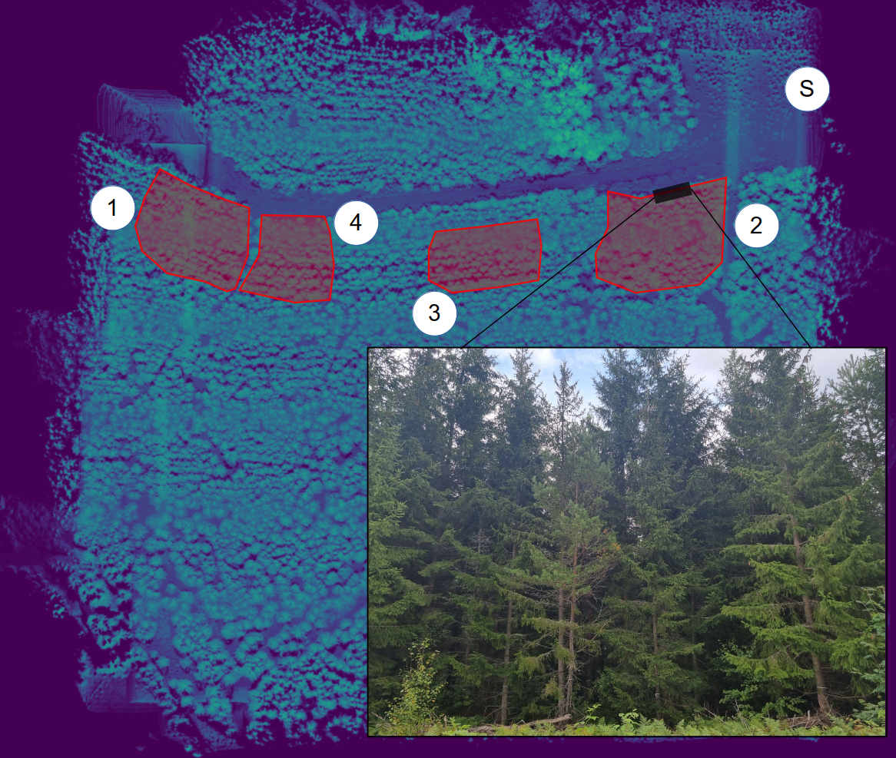
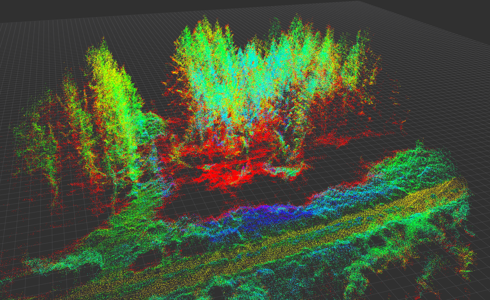
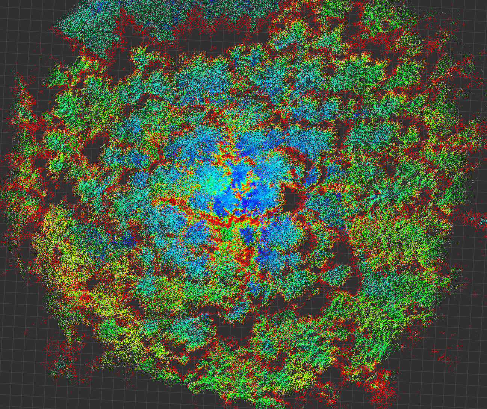

# dense-forest-dataset
This repository contains descriptions and links to a dataset collected by UAV over dense boreal forest. 

The files are available for download [HERE](https://huggingface.co/Alwaki/forest_dataset/tree/main).

## Usage
The annotations are provided for each plot as excel files in the "annotations" folder. We describe here the meaning of the columns in the annotations:

* ID: identity of the annotation
* X: planar X-coordinate of tree trunk at breast height (in meters)
* Y: planar Y-coordinate of tree trunk at breast height (in meters)
* Species: S = Spruce, P = Pine, B = Broadleaf
* DBH: Diameter at breast height (in cm)
* Circumference: Circumference of stem at breast height (in cm). Note, This is equivalent to DBH*pi

Please note that the ID does not continuously follow integer updates. There may be jumps in the ID numbering. Moreover, positions of the drone are provided in latitude and longitude, while the positions of the annotations are in SWEREF 99-12 planar coordinates. We provide a reference transformation method in the folder "transformation", with Gauss-Krieger and using C++. Lastly, the circumference sometimes has an extra row entry. This indicates a split growth in the tree trunk, with two separate stems.

We also provide frame transforms between GPS coordinates and lidar, and the essential matrix between lidar and camera. These can be found in the "sensor_transforms" folder.

## Data collection process
The dataset is collected over 4 plots, located as seen in the image below. The symbol "S" indicates where the drone takes off from. For collection, a Matrice 300 drone is used. Ranged sensor modalities include LiDAR (Livox Avia), and RGB camera (Basler dart 1600-60uc). Each plot is provided as a separate file, with corresponding information regarding annotations and sensor extrinsics provided. The files are stored in a separate repository, in case storage options change over time.

## Visual examples
The output can be visualized in for example RVIZ from the rosbags, as shown here

### RVIZ angled point cloud visualization

### RVIZ top down point cloud visualization

